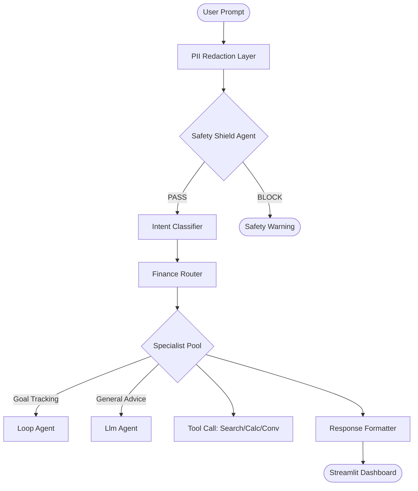

# 🏦 AI Personal Finance Advisor

[](https://deepmind.google/technologies/gemini/)
[](https://google.github.io/adk-docs/)
[](https://cloud.google.com/vertex-ai)

A sophisticated, multi-agent financial intelligence system designed for strategic planning, expense analysis, and personalized financial coaching. Built with the **Google Agent Development Kit (ADK)** and **Gemini 2.0**, this system provides a secure, expert-level consulting experience.


*Figure 1: The Advisor's Premium Streamlit Interface, featuring real-time guardrail monitoring and execution mode toggling.*

## 🌟 Core Intelligence & Features

### 1. Hierarchical Multi-Agent Orchestration
The advisor utilizes a powerful three-tier architecture to deliver precision advice:
*   **Intent Tier**: Classifies user queries (Budget, Goal, Investment, etc.) and analyzes potential risks.
*   **Specialist Tier**: Five dedicated LLM Agents equipped with specialized tools:
    *   **ExpenseAnalyzer**: Identifies spending leaks and savings opportunities.
    *   **BudgetAdvisor**: Generates optimized monthly allocation plans.
    *   **GoalTracker**: Uses an iterative `LoopAgent` to refine long-term financial milestones.
    *   **CurrencyConverter**: Accesses real-time exchange rates for global planning.
    *   **FinanceTutor**: Provides deep dives into complex financial concepts using web research.
*   **Synthesis Tier**: Aggregates specialist findings into a cohesive, structured advisor response.

### 2. Enterprise-Grade Security (Guardrails)
*   **PII Redaction**: All sensitive user data (Emails, Phone Numbers, SSNs) is automatically masked before reaching the LLM.
*   **Model-Based Safety Shield**: A dedicated "Screening Agent" validates every query against institutional safety standards before execution.

### 3. Dual-Mode Deployment
Seamlessly transition between **Local Development** (directly via Python/Streamlit) and **Production** (Vertex AI Reasoning Engine).

## 🛠️ Setup & Operations

### Environment Configuration
Create a `.env` file in the project root:
```env
GOOGLE_API_KEY='your_gemini_api_key'
GOOGLE_GENAI_MODEL='gemini-2.0-flash-lite-preview-02-05'

# GCP Production Settings
PROJECT_ID='your-gcp-project-id'
LOCATION='us-central1'
STAGING_BUCKET='gs://your-deployment-bucket'
RESOURCE_ID='your-vertex-resource-id'
```

### Quick Installation
```bash
# Set up virtual environment
python -m venv .venv
source .venv/bin/activate  # Or .venv\Scripts\activate on Windows

# Install core dependencies
pip install -r requirements.txt
```

### Execution Commands
| Task | Command |
| :--- | :--- |
| **Run Dashboard** | `streamlit run frontend/app.py` |
| **Verify Agent** | `python verify_agent.py` |
| **GCP Deploy** | `python deploy/deploy.py` |
| **Resource Cleanup**| `python deploy/cleanup.py` |

## 🏗️ Architecture Visualization



## 📜 Disclaimer
*This system is an AI-driven tool for information and educational purposes only. It does not constitute professional financial, tax, or legal advice. Always consult with a licensed professional before making significant financial decisions.*
