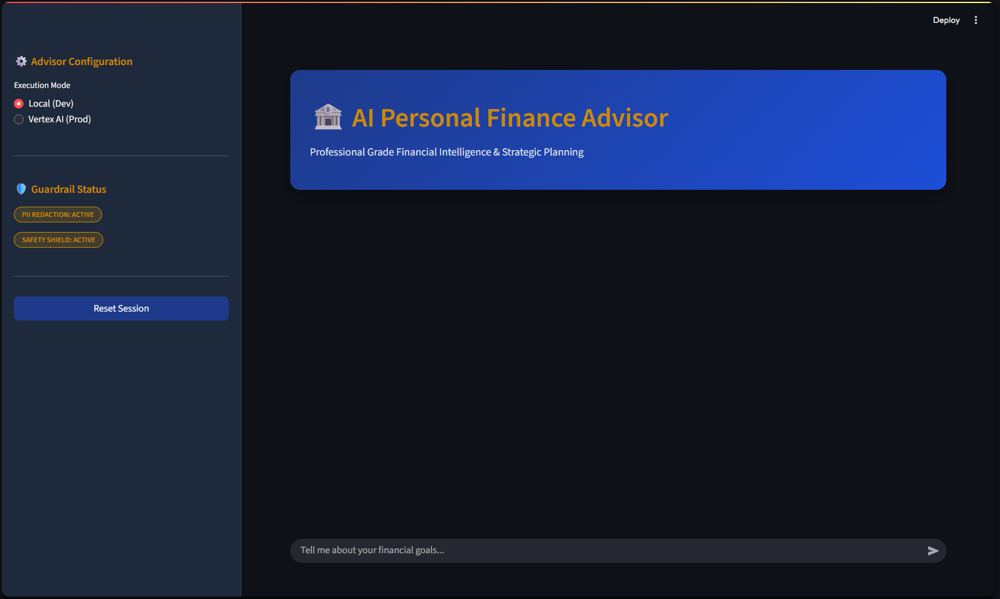
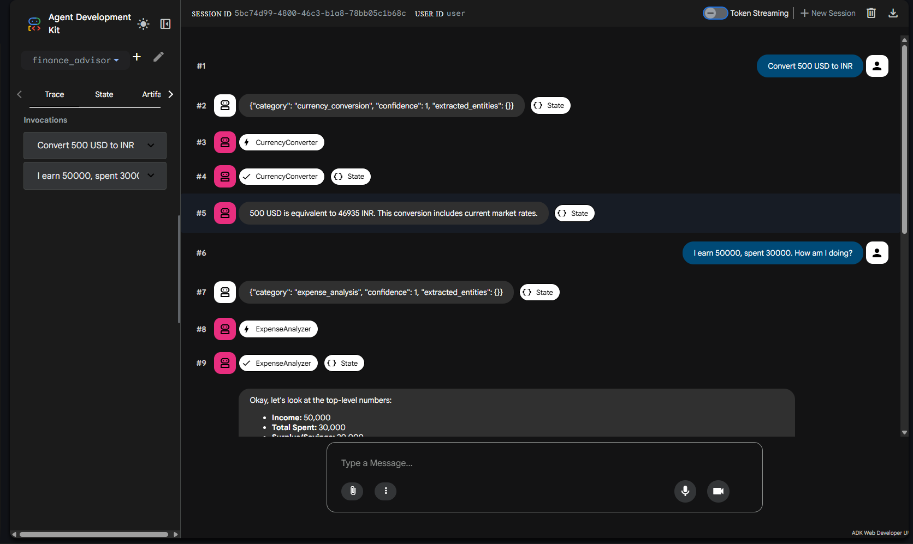

# 🏦 AI Personal Finance Advisor

[](https://deepmind.google/technologies/gemini/)
[](https://google.github.io/adk-docs/)
[](https://cloud.google.com/vertex-ai)

A sophisticated, multi-agent financial intelligence system designed for strategic planning, expense analysis, and personalized financial coaching. Built with the **Google Agent Development Kit (ADK)** and **Gemini 2.0**, this system provides a secure, expert-level consulting experience.

---

## 📸 Visual Walkthrough

### 1. The Executive Dashboard (Streamlit)
The user-facing dashboard provides a clean, premium interface for daily financial management.


### 2. The Developer Workshop (ADK Web)
Monitor the internal "thinking" process, tool calls, and agent transitions in real-time using the ADK Developer UI.


---

## 🌟 How It Works: The Orchestration Layer

The Finance Advisor isn't just one bot—it's a team of specialized AI experts working in a **Multi-Tier Pipeline**:

### 🛡️ Tier 1: Security & Guardrails (The Shield)
*   **PII Redaction**: Automatically scrubs sensitive data (Emails, SSNs) before it hits the LLMs.
*   **Safety Screen**: Every query is filtered by a dedicated screening agent to ensure advice meets institutional safety standards.

### 🧠 Tier 2: Intent & Routing (The Brain)
*   **Classifier**: Uses a Pydantic-mapped schema to identify the user's core intent.
*   **Finance Router**: Dynamically selects the best specialist tool for the job.

### 💼 Tier 3: Specialist Execution (The Experts)
*   **Expense Analyzer**: Digs into spending patterns to find hidden savings.
*   **Budget Advisor**: Uses custom Python tools to calculate complex monthly allocations.
*   **Goal Tracker**: An iterative `LoopAgent` that refines your goals until they are mathematically sound.
*   **Currency Converter**: Connects to real-time market data for international planning.
*   **Finance Tutor**: Performs deep-dive web research to answer "What is...?" questions.

---

## 🛠️ Quick Start Guide

### 1. Setup Environment
Clone the repo and create your `.env` file from the template:
```bash
cp .env.example .env
# Open .env and paste your GOOGLE_API_KEY and PROJECT_ID
```

### 2. Install & Run
```bash
# Install dependencies
pip install -r requirements.txt

# Run the Premium Dashboard
streamlit run frontend/app.py

# Run the Developer UI (to see the "Agent Logic")
adk web
```

## 🚀 Cloud Deployment
Ready for production? Deploy your advisor as a **Vertex AI Reasoning Engine** with one command:
```bash
python deploy/deploy.py
```

---
*Disclaimer: This system is for educational purposes. Always consult a human financial professional for significant financial decisions.*
